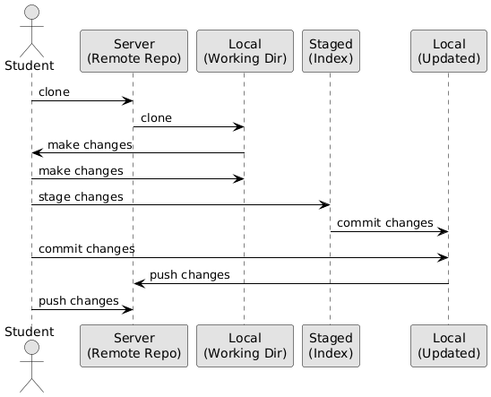

# Git "areas"

### Explanation of the Diagram
- **Server (Remote Repo)**: This is the central repository hosted on GitHub (or another server). It holds the official version of your project.
  - **Action**: `clone` - Copies the server repository to your local machine.
- **Local (Working Dir)**: This is your local copy of the repository on your computer where you make changes.
  - **Action**: `make changes` - Edit files directly in your working directory.
- **Staged (Index)**: This is a temporary area where changes are prepared before being committed.
  - **Action**: `stage changes` - Use `git add` to move changes from the working directory to the staging area.
- **Local (Updated)**: After committing, the local repository is updated with the new commit.
  - **Action**: `commit changes` - Use `git commit` to save staged changes to your local repository history.
- **Back to Server**: The updated local changes are pushed back to the server.
  - **Action**: `push changes` - Use `git push` to send committed changes to the remote repository.

### Step-by-Step Guide for Students

#### 1. Clone from Server to Local
- Command: `git clone <repository-SSH-URL>`
- **What Happens**: Copies the remote repository (Server) to your computer (Local).

#### 2. Make Changes in Local
- **Action**: Edit files in your local working directory (e.g., using Notepad or VS Code).
- **Note**: Changes are only in your working directory until staged.

#### 3. Stage Changes
- Command: `git add <file-name>` or `git add .`
- **What Happens**: Moves changes from the Local working directory to the Staged area.

#### 4. Check your Changes
- Command: `git status`
- **What Happens**: The status of your changes are displayed. Files shown in green are staged and files in red have been changed, but are not staged.

#### 5. Commit Changes
- Command: `git commit -m "Your message"`
- **What Happens**: Saves the staged changes to your Local repository, updating its history.

#### 6. Push Changes to Server
- Command: `git push`
- **What Happens**: Uploads your committed changes from Local back to the Server.

### Key Concepts
- **Server**: The remote repository (e.g., on GitHub).
- **Local**: Your local copy, including the working directory and committed history.
- **Staged**: A middle step where you prepare changes before committing.