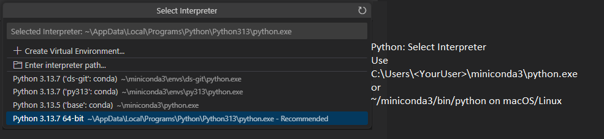
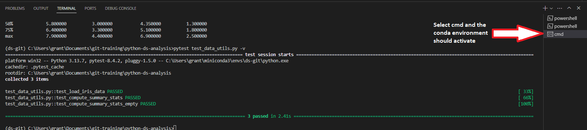

# Guide to Set Up Miniconda on Windows

This guide will help you install and configure **Miniconda** on a Windows system, tailored for Python 3.13.7. Miniconda is a minimal installer for conda, including only conda, Python, and essential packages like pip and zlib.

## Step 1: Download the Miniconda Installer
1. **Visit the Download Page**:
   - Download the Miniconda installer for Windows from: [Miniconda3-latest-Windows-x86_64.exe](https://repo.anaconda.com/miniconda/Miniconda3-latest-Windows-x86_64.exe).
   
2. **Select the Correct Installer**:
   - Ensure you download the 64-bit version if your system is 64-bit (check in Windows Settings > System > About).
   - The installer is compatible with Python 3.13 and works for most modern Windows systems.

## Step 2: Install Miniconda
1. **Run the Installer**:
   - Locate the downloaded `Miniconda3-latest-Windows-x86_64.exe` file and double-click to run it.
   - If prompted by Windows User Account Control (UAC), click “Yes” to allow changes.
2. **Follow the Installation Wizard**:
   - **Welcome Screen**: Click “Next.”
   - **License Agreement**: Read and accept the terms, then click “Next.”
   - **Installation Type**: Select “Just Me” (recommended unless you have admin privileges for all users) and click “Next.”
   - **Destination Folder**: Use the default `C:\Users\<YourUsername>\Miniconda3` or choose another location with at least 400 MB free space. Click “Next.”
   - **Advanced Options**:
     - **Add Miniconda to PATH**: Uncheck this box to avoid conflicts with other Python installations (Miniconda uses its own environment system).
     - **Register Miniconda as the default Python**: Check this if you want Miniconda’s Python to be the default for `python` commands. If you have another Python version (e.g., Python 3.13.7), uncheck to avoid conflicts.
   - Click “Install” and wait for completion.
   - Click “Finish” to close the wizard.

## Step 3: Verify the Installation
1. **Open Anaconda Prompt**:
   - Search for “Anaconda Prompt (Miniconda)” in the Windows Start menu and open it.
2. **Check Conda Version**:
   - Run:
     ```bash
     conda --version
     ```
   - Expected output: `conda 24.x.x` (version may vary). This confirms Miniconda is installed.
3. **Check Python Version**:
   - Run:
     ```bash
     python --version
     ```
   - This shows Miniconda’s default Python version (likely 3.9 or similar). It may differ from your system’s Python 3.13.7, as Miniconda manages its own environments.

## Step 4: Update Conda
1. **Update Conda**:
   - In the Anaconda Prompt, run:
     ```bash
     conda update conda
     ```
   - Type `y` to confirm updates if prompted.
2. **Optional: Update All Packages**:
   - Run:
     ```bash
     conda update --all
     ```

## Step 5: Create and Manage Environments
Miniconda uses environments to isolate Python versions and packages, preventing conflicts.
1. **Create a Python 3.13 Environment**:
   - Run:
     ```bash
     conda create -n py313 python=3.13
     ```
   - This creates an environment named `py313` with Python 3.13.x (the closest available version, e.g., 3.13.7 if available). Check available versions with:
     ```bash
     conda search python
     ```
2. **Activate the Environment**:
   - Run:
     ```bash
     conda activate py313
     ```
   - The prompt should show `(py313)`, indicating the environment is active.
3. **Verify Python Version**:
   - Run:
     ```bash
     python --version
     ```
   - It should show Python 3.13.x.
4. **Install Packages**:
   - Install common packages (e.g., NumPy, pandas, Jupyter):
     ```bash
     conda install numpy pandas jupyter
     ```
   - Install other packages as needed (e.g., scikit-learn, TensorFlow).
5. **Deactivate the Environment**:
   - Run:
     ```bash
     conda deactivate
     ```

## Step 6: Optional - Install Anaconda Navigator
- **Anaconda Navigator** is a GUI for managing environments and packages. It’s not included in Miniconda by default but can be installed:
  ```bash
  conda install anaconda-navigator
  ```
- Launch it from the Windows Start menu.

## Step 7: Troubleshooting
- **Command Not Found**: Use the Anaconda Prompt, not regular Command Prompt or PowerShell, for `conda` commands.
- **Conflicts with System Python**: If your system’s Python 3.13.7 interferes, ensure Miniconda’s PATH doesn’t override it. Use `conda activate` to switch environments.
- **Package Installation Issues**: For packages not found in the default channel, try the `conda-forge` channel, e.g.:
  ```bash
  conda install -c conda-forge tensorflow
  ```
- **Terms of Service**: Miniconda is free for individual use or organizations with fewer than 200 employees/contractors. Check the [Anaconda Terms of Service](https://www.anaconda.com/terms-of-service) for larger organizations.

## Step 8: Explore Miniconda Features
- **Conda**: Manage packages and environments with `conda install`, `conda create`, and `conda env` commands.
- **Minimal Installer**: Includes only conda, Python, and essential packages (e.g., pip, zlib) for a lightweight setup.
- **Cloud Backup**: Connect to Anaconda’s community portal via Navigator to back up environments (requires an account).


## Miniconda with Visual Studio Code
This is a quick guide to using miniconda in Visual Studio Code.

### Step 1: Install the Python Extension in VS Code

Open VS Code.
Go to the Extensions view (click the Extensions icon in the sidebar or press `Ctrl+Shift+X` / `Cmd+Shift+X` on macOS).
Search for "Python" (published by Microsoft).
Install it. This extension enables Python support, including Conda environment detection.

### Step 2: Configure VS Code to Recognize Miniconda

Open the Command Palette (`Ctrl+Shift+P` / `Cmd+Shift+P`).
Type and select Python: `Select Interpreter`.
VS Code will scan for available interpreters, including those from Miniconda (e.g., in `~/miniconda3/bin/python` on macOS/Linux or `C:\Users\<YourUser>\miniconda3\python.exe` on Windows).
Select the desired interpreter (start with the base one if you're unsure).



#### If Miniconda doesn't appear automatically
Configure the Python settings in VS Code:
File > Preferences > Settings > Extensions > Python
Update the following:
- **Default Interpreter Path** set to `C:\Users\<YourUser>\miniconda3\python.exe` (or `~/miniconda3/bin/python` on macOS/Linux)
- **Python: Conda Path** set to `C:\Users\<YourUser>\miniconda3\` (or `~/miniconda3/bin/` on macOS/Linux)

I found that powershell terminal in VS Code does not detect correctly. However, using Windows `Command` does. The `Command` prompt can be activated by using the small + on the top right of the Terminal screen. Here is a small screensho to explain this:
 

## Additional Resources
- [Miniconda Documentation](https://docs.conda.io/en/latest/miniconda.html)
- [Anaconda Community Portal](https://www.anaconda.com/)

--- 
